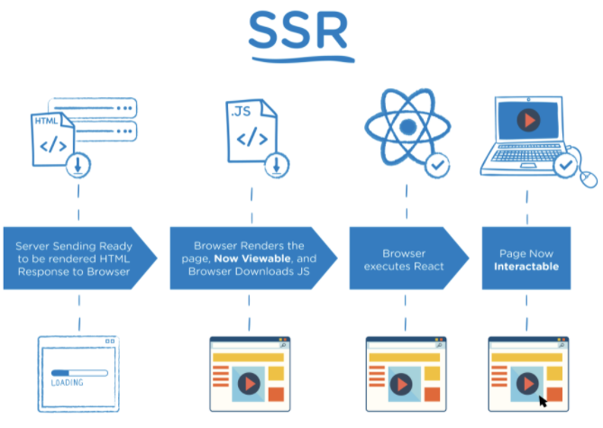
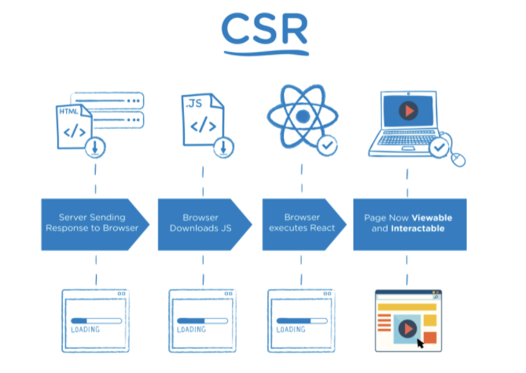
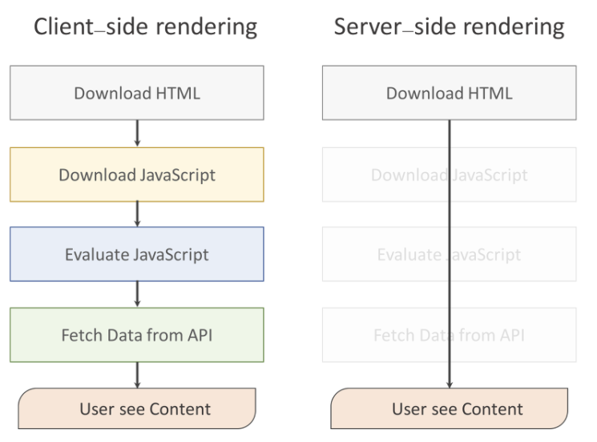
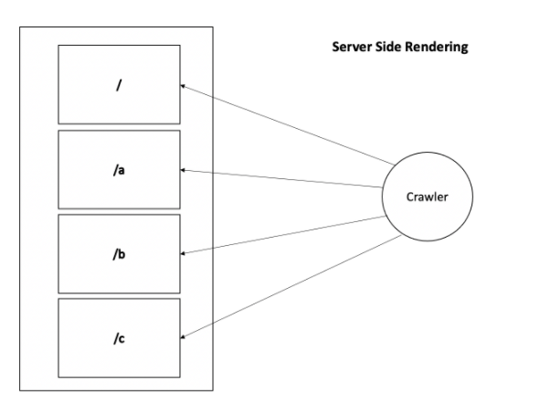
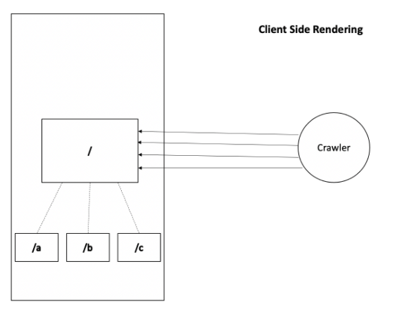
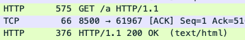
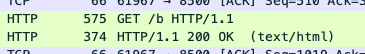
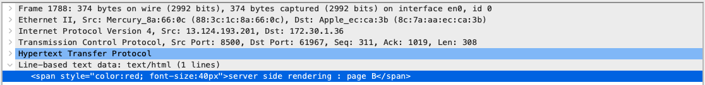
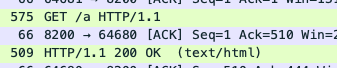
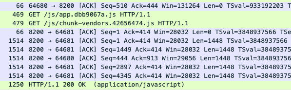

### 개요
Vue와 React는 대표적인 Single page application(SPA) framework으로 Client Side Rendering(CSR) 방식으로 View를 만듭니다.  
반면, PHP는 Multi page application(MPA) 방식으로 Server Side Rendering(SSR) 방식으로 View를 만듭니다.  

이러한 렌더링 방식의 차이를 이해하고, 패킷 분석 툴을 활용하여 요청/응답 과정을 확인합니다. 
나아가 이처럼 일반적으로 SPA = CSR, MPA = SSR 이라고 공식처럼 얘기되지만, 정확히는 MPA가 주로 SSR을 사용하는 것이고, SPA가 주로 CSR을 사용하는 것입니다.

### 들어가기 앞서...
* SPA(Single Page Application) : 한 개의 페이지로 구성된 어플리케이션 
* MPA(Multiple Page Application) : 여러개의 페이지로 구성된 어플리케이션
* SSR(Server Side Rendering) : 서버 측에서 렌더링하는 방식
* CSR(Client Side Rendering) : 클라이언트 측에서 렌더링하는 방식

* 렌더링(Rendering) : 내용을 브라우저 화면에 표시하는 것

---

### SSR vs CSR

SSR은 완제품, CSR은 조립식입니다.

#### SSR(Server Side Rendering)
SSR(Server Side Rendering)은 Web Server에서 View(HTML)를 생성합니다.

#### SSR의 렌더링 방식  

> 1.브라우저에서 URL 입력을 통해 서버에 HTTP 요청을 보낸다.  2. 서버가 요청을 받아 해당 페이지를 만들기 시작한다.   3. 필요한 data fetching(데이터 가져오기)을 미리 해서 빈 페이지가 아닌 초기 콘텐츠가 로딩된 페이지를 만들어준다.   4. 브라우저는 서버에서 만들어 준 HTML 페이지를 받아 페이지를 DOM에 그린다. (페이지가 사용자에게 보이는 시점)   5. 페이지를 그리며 태그를 통해 JS, CSS 파일 등을 로딩한다.   6. 로딩된 JS를 실행한다.

#### SSR의 특징
페이지가 전환될 때 마다 client가 server에 View를 요청하고, server는 그것을 생성 후 client에게 보내줍니다. 이러한 과정으로 인해 View 전환 속도가 CSR에 비해 상대적으로 늦습니다. 그리고 page 요청이 빈번해 질수록 CSR에 비해 server에 부하가 커지게 됩니다.

정리
> 장점   1. 초기 로딩속도가 빠릅니다. (서버에서 한번에 완성된 페이지를 받아오기 때문입니다.)   2. 검색 엔진 최적화(SEO) 사용 가능합니다.

> 단점   1. 페이지 이동 시 화면 깜빡임.   2. 페이지 이동 시 변경이 불필요한 데이터도 같이 로드됩니다.

---

#### CSR(Client Side Rendering)
CSR(Client Side Rendering)은 브라우저(Client)에서 JS에 의해 View(HTML)을 동적으로 생성합니다.   
SSR과는 다르게 하나의 HTML 파일로 모든 페이지를 구성합니다.

#### CSR의 렌더링 방식  

> 1.브라우저에서 URL 입력을 통해 서버에 HTTP 요청을 보낸다.  2. 빈 HTML을 내려받습니다. (다만, 여러 JS, CSS파일을 불러올 수 있는 링크들이 있습니다.)   3. 브라우저가 JS 코드를 실행합니다. (이때, JS 코드 안에서 Vue, React 등이 구동됩니다.)   4. VirtualDOM 구성이 완료되면, 이를 브라우저의 DOM에 붙입니다.   5. 브라우저가 페이지를 그립니다.

#### CSR의 특징
페이지 전환이 SSR보다 상대적으로 빠릅니다. 대신 최초 접속 시, 모든 JS와 static 파일(HTML, image)를 가져와야 하므로, 최초 접속 시의 로딩은 SSR에 비해 늦습니다.

> 장점   1. 페이지 전환이 빠릅니다. (사용자 경험 향상)   2. 서버와 클라인언트 간의 데이터 양과 트래픽이 SSR에 비해 현저히 감소합니다.

> 단점   1. 초기 구동 속도가 느립니다. (JS파일을 번들링해서 한 번에 받아오기 때문입니다.)   2. 검색 엔진 최적화(SEO)가 어렵습니다. (돠긴 합니다.)

#### 그림으로 한 눈에 비교하기

---

### 검색 엔진 최적화(Search Engine Optimization)
검색 엔진 최적화(SEO)는 홈페이지 혹은 콘텐츠를 검색 결과의 상단에 위치시키는 작업을 말합니다.  
검색 엔진은 "크롤링"과 "인덱싱"을 통해 정보를 카테고리화 합니다.  

#### 동작 과정
검색 엔진은 각 페이지들에 노출된 `index.html`에 달린 `meta tag`와 `title`들을 파싱하며 어떤 정보를 노출시킬지 정하게 됩니다.

#### 왜 SEO가 중요한가?
SEO가 제대로 되지 않았다면, 검색해도 안 나올 수 있습니다.  
예를 들어, Apple 사이트 주소를 모르는 상황이라면, 대부분 검색창에 apple이라고 칩니다.  
이때, 만약 사이트가 나오지 않는다면? 다른 사람에게 물어보거나 다른 사이트를 거쳐 들어가는 방법밖에 없을 것입니다.  

이러한 문제는 BtoC 서비스를 진행하는 회사의 경우 치명적일 것입니다.

#### 그럼 CSR이 검색 엔진 최적화가 어려운 이유?

|SSR|CSR|
|------|---|
|||

SSR은 각각의 페이지('/', '/a', '/b', '/c')를 가지므로 html이 여러개입니다.  
이로 인해 검색엔진 크롤러는 해당 페이지에 대한 정보들을 파싱할 수 있습니다.  

CSR은 각 페이지('/a', '/b', '/c')가 루트 페이지('/')를 바라보고 있습니다.  
이로 인해 검색엔진 크롤러는 HTML을 파싱해도 모두 똑같은 파일이 나오게 됩니다.  

결국, 검색서비스 노출 및 SNS 공유 기능 등이 원하는대로 동작할 수 없게 됩니다.

#### CSR에 SEO를 적용해도 SSR에 비해 불리한 이유

CSR을 사용하면 View를 생성하기 위해서 JS가 필요하고(그 전까지는 빈 페이지이기 때문에 View가 완성되지 않아서), View를 생성하기 전까지는 크롤링을 할 수 없는 시점이 발생합니다.  
이는 상대적으로 검색 엔진 서비스에 노출되는 것이 줄어듦을 말합니다.

#### 방안
두 가지 렌더링 방법을 적절하게 사용하여 첫 번째 페이지 로딩에서는 SSR을 사용하고, 그 후에 모든 페이지 로드에는 CSR을 활용하는 방법을 많이 사용한다고 합니다.

---

### Wireshark를 통한 네트워크 요청&응답 확인
Wireshark는 자유 및 오픈 소스 패킷 분석 프로그램입니다.
패킷을 분석하는 Tool이기 때문에 사용자에 따라 사용 목적이 상이하지만,  
여기선, 클라이언트와 서버 간 View를 요청/응답하는 패킷을 확인하는 정도로만 사용합니다.

* MPA에서의 렌더링
Server Side Rendering의 네트워크 요청/응답을 확인해봅시다.

1. 최초 접속  

2. page 전환  

3. 패킷이 캡처된 모습  

Client Side Rendering에서 네트워크 요청/응답을 확인해봅시다.

1. 최초 접속  

2. 최초 접속 시, js 및 static file을 다운로드 받는다.  

https://velog.io/@sunaaank/React-deep-dive#csr%EA%B3%BC-ssr%EC%9D%98-%EC%83%81%ED%98%B8%EB%B3%B4%EC%99%84

https://mygumi.tistory.com/385

https://krpeppermint100.medium.com/web-seo-ssr-csr-82f9b7e42e21

https://devowen.com/309

https://velog.io/@kja/Virtual-DOM

